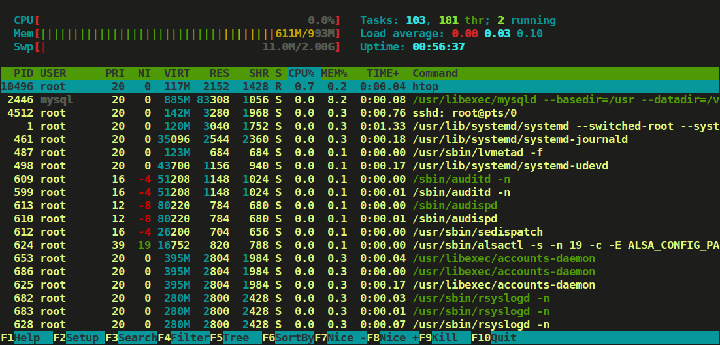

# htop

## 前言
htop是一个linux下的实时的线程监控工具，htop提供了以下工具：

* In htop you can scroll vertically to view the full process list, and scroll horizontally to view the full command lines.
* It starts very quickly as compared top, because it doesn’t wait to fetch data during startup.
* In htop you can kill more than one processes at once without inserting their PIDs.
* In htop you no longer needed to enter process number or priority value to re-nice a process.
* Press “e” to print the set of environment variables for a process.
*  Use mouse to select list items.




## 使用rpm包安装htop

* 安装 EPEL repository 

```
-------------- For RHEL/CentOS 7 --------------
wget dl.fedoraproject.org/pub/epel/7/x86_64/Packages/e/epel-release-7-11.noarch.rpm
rpm -ihv epel-release-7-11.noarch.rpm 

-------------- For RHEL/CentOS 6 --------------
wget http://download.fedoraproject.org/pub/epel/6/x86_64/epel-release-6-8.noarch.rpm
rpm -ihv epel-release-6-8.noarch.rpm
```

* 安装
```
 yum install htop
```