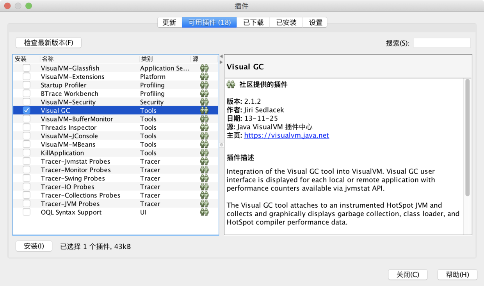

# JVisualVm可视化监控

## 启动

jdk的安装目录下找到并双击jvisualvm，或者直接命令行运行jvisualvm。

## 安装插件

* 根据java版本获取插件中心的地址：https://visualvm.github.io/pluginscenters.html

> JDK 8 Update 131 - 181  
> ``https://visualvm.github.io/uc/8u131/updates.xml.gz``
> JDK 8 Update 40 - 121 
> JDK 7 Update 79 - 80 
> `` https://visualvm.github.io/archive/uc/8u40/updates.xml.gz``
> JDK 8 Update 20 - 25 
> ``https://visualvm.github.io/archive/uc/8u20/updates.xml.gz``

* 点击 工具->插件->设置



##  本地tomcat 

打开JVisualVm 既可以开始监控。

## 远程tomcat 

* 新建权限文件
```
mv $JAVA_HOME/jre/lib/management/jmxremote.password.template $JAVA_HOME/jre/lib/management/jmxremote.password
```
* 设置用户名密码``vim $JAVA_HOME/jre/lib/management/jmxremote.password``
```
# Following are two commented-out entries.  The "measureRole" role has
# password "QED".  The "controlRole" role has password "R&D".
#
monitorRole  QED123
root 123456
```
* 修改文件权限
```
chmod 0200 $JAVA_HOME/jre/lib/management/jmxremote.password
```

* 修改 vim $JAVA_HOME/jre/lib/management/jmxremote.access
```
monitorRole   readonly
root readwrite \
              create javax.management.monitor.*,javax.management.timer.* \
              unregister
```
* 修改文件权限
```
chmod 0400  $JAVA_HOME/jre/lib/management/jmxremote.password
```

* 修改 /{tomcat path}/bin/catalina.sh 
* 找到第一个没注释的JAVA_OPTS，在前面添加；
```
JAVA_OPTS="-Djava.rmi.server.hostname=192.168.152.129
-Dcom.sun.management.jmxremote.port=8099 
-Dcom.sun.management.jmxremote.rmi.port=8099 
-Dcom.sun.management.jmxremote.ssl=false 
-Dcom.sun.management.jmxremote.authenticate=true
"
```

* 打开端口
```
firewall-cmd --zone=public --add-port=8099/tcp --permanent  
firewall-cmd --reload  
firewall-cmd --zone=public --query-port=8099/tcp  
```

* 在监控电脑上使用jvisualvm软件登陆
> 用户名： controlRole
> 密码：     R&D445
> 链接：     192.168.3.90:9004


## 监控普通java进程
 