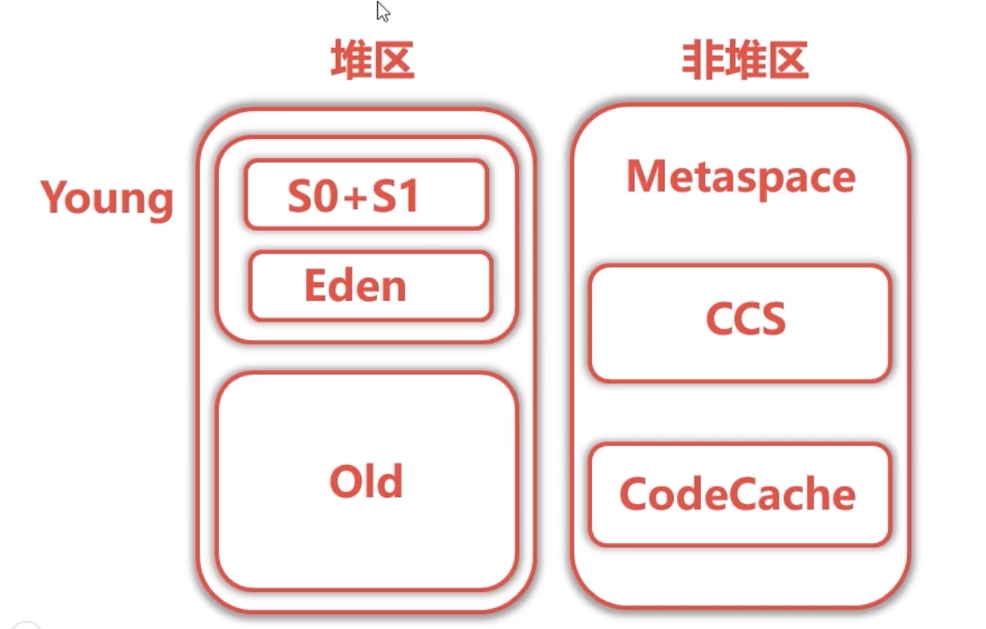

## jvm的结构

## 标准参数

* -help 
* -server -client 
* -version -showversion 
* -cp -classpath 

## X参数，非标准参数
* -Xint  -- 解释执行
* -Xcomp -- 第一次使用就编译成本地代码
* -Xmixed -- 混合模式，jvm自己决定

## XX参数

* 非标准参数
* 相对不稳定
* 主要是用来JVM调优和DEBUG

### boolean类型

格式: -XX:[+-]<name>  表示启动或者禁止name属性

如: -XX:+UseConcMarkSweepGC
     -XX:+UseG1GC

### 非boolean类型参数
格式:-XX:<name>=<value>  表示设置name的属性值为value
比如: -XX:MaxGCPauseMillis=500
         -XX:GCTimeRatio=19

>  -Xms等价于 -XX:InitialHeapSize  初始化队列大小
>  -Xmx 等价于 -XX:MaxHeapSize   最大队列大小

补充：
查看进程jinfo -flag MaxHeapSize 19870 

